# Изоляция на отдельное ядро

```
sudo nice -n -20 taskset -c 0 ./hash
```

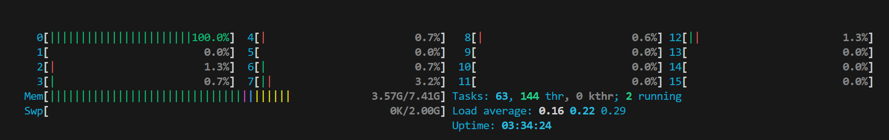

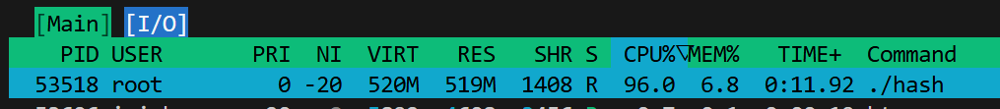


```
cnt input words: 1165861
cnt search words: 5131469 * 10 = 51314690
```


# base_O0

1: $21644574432$ \
2: $21726231378$ \
3: $21748913046$

Avg: $21706572952$


# base_O3

1: $17630238186$ \
2: $17702316397$ \
3: $17794250043$

Avg: $17708934875$

Ускорение: на $22.57$ процентов


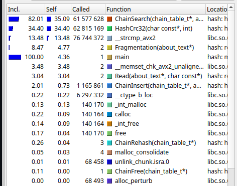

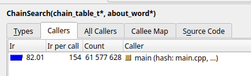

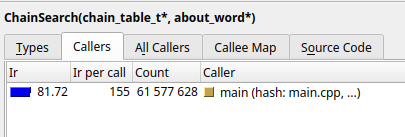

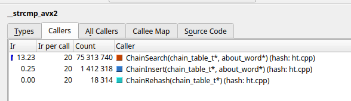

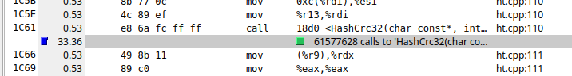

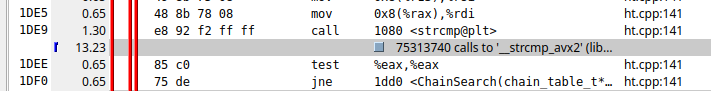

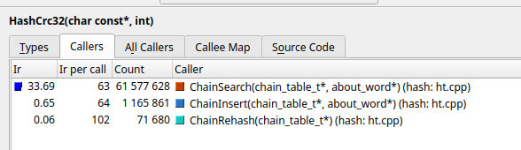

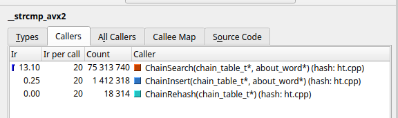


Func Name            | Self (%)     | Instructions per call |  
---------------------|--------------|-----------------------|
ChainSearch          | 35.26        | 155                   | 
HashCrc32            | 34.06        | 63                    | 
Strlen               | -            | -                     | 
Strcmp               | 13.35        | 20                    | 


# crc32

1: $15468634388$ \
2: $15546548296$ \
3: $15598880794$

Avg: $15538021159$

Ускорение: на $13.97$ процента

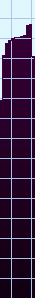

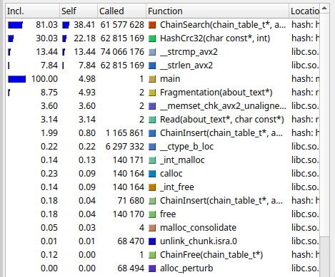

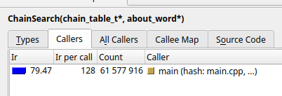

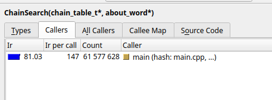

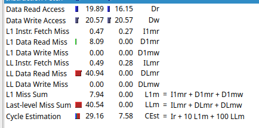

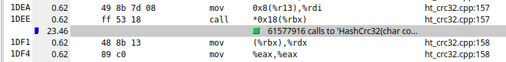

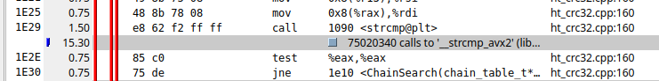

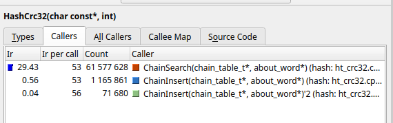

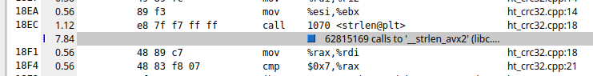

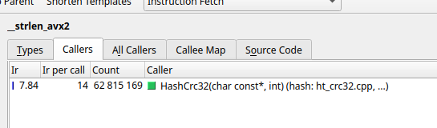

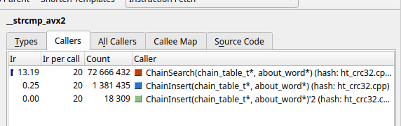


Было:
```
while (*key != '\0')
    crc = (crc << 8) ^ crc32_table[((crc >> 24) ^ (uint8_t)*key++) & 0xFF];
```

В годболте:
```
mov     ecx, eax
shr     eax, 24
add     rdi, 1
xor     edx, eax
sal     ecx, 8
movzx   edx, dl
mov     eax, DWORD PTR crc32_table[0+rdx*4]
movzx   edx, BYTE PTR [rdi]
xor     eax, ecx
test    dl, dl
jne     .L5
```


Использовала интрисики:
```
size_t i = 0;
for (; i + 8 <= len; i += 8) {
    unsigned long long cur_ptr = *(const unsigned long long*)(str + i);
    hash = _mm_crc32_u64(hash, cur_ptr);
}
```

В годболте это преобразовалось в:
```
crc32   rcx, QWORD PTR [rbx-8+rax]
mov     rdx, rax
lea     rax, [rax+8]
cmp     rsi, rax
jnb     .L4
mov     eax, ecx
```


Func Name            | Self (%)     | Instructions per call |  
---------------------|--------------|-----------------------|
ChainSearch          | 38.41        | 147                   | 
HashCrc32            | 22.18        | 53                    | 
Strlen               | 7.84         | 14                    | 
Strcmp               | 13.44        | 20                    | 


# strlen

1: $15352624454$ \
2: $15369602398$ \
3: $15487699347$

Avg: $15403308733$

Ускорение: на $0.87$ процента

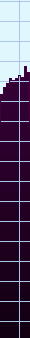

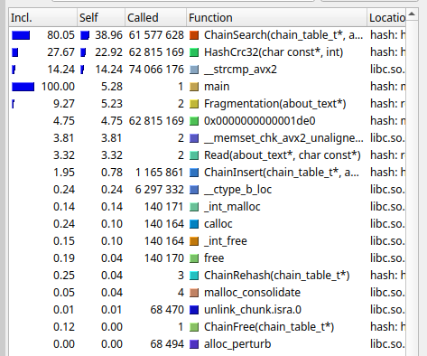

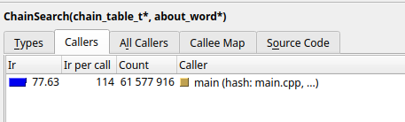

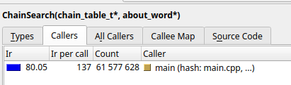

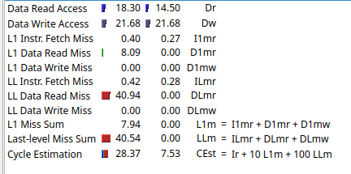

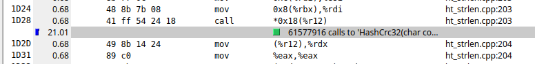

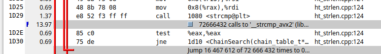

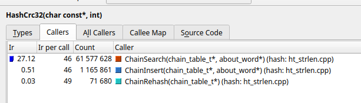

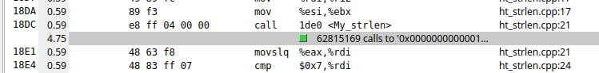

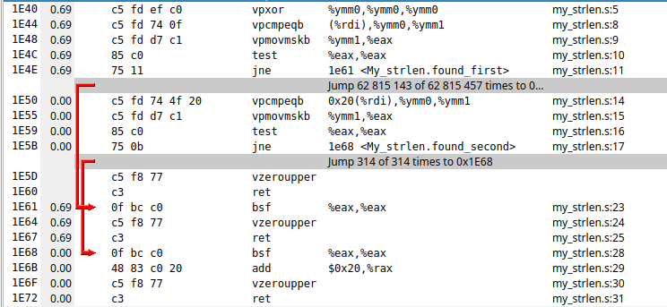

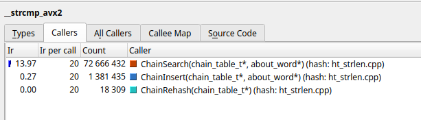


Func Name            | Self (%)     | Instructions per call |  
---------------------|--------------|-----------------------|
ChainSearch          | 38.96        | 137                   | 
HashCrc32            | 22.92        | 46                    | 
Strlen               | 4.75         | 8                     | 
Strcmp               | 14.24        | 20                    | 


# strcmp

1: $15300917415$ \
2: $15347362175$ \
3: $15456730300$

Avg: $15368336630$

Ускорение: на $0.23$ процента


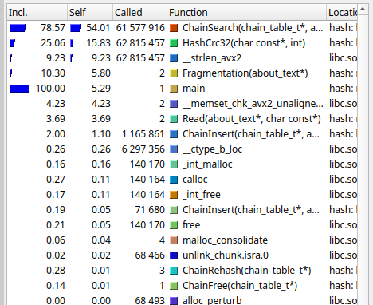

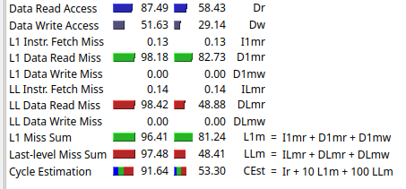

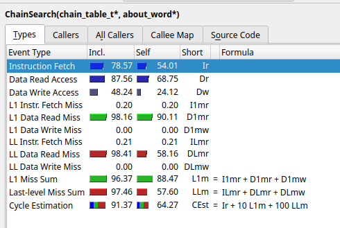

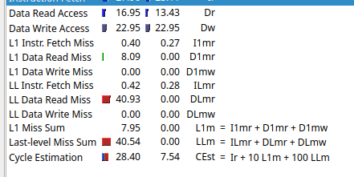

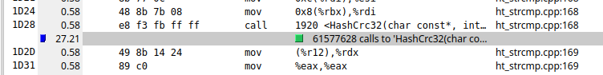

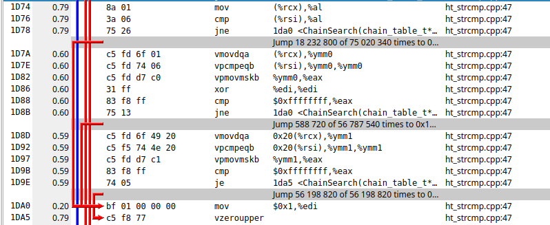

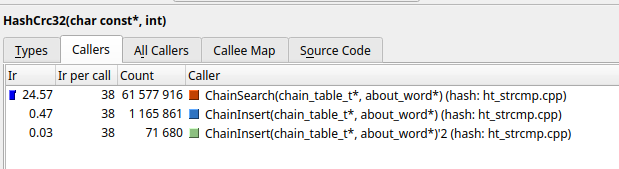

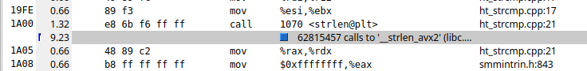

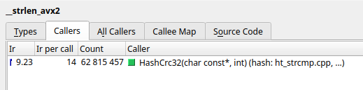

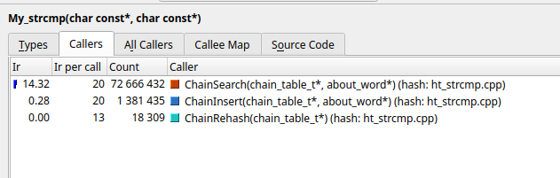


Func Name            | Self (%)     | Instructions per call |  
---------------------|--------------|-----------------------|
ChainSearch          | 38.46        | 136                   | 
HashCrc32            | 23.00        | 46                    | 
Strlen               | 4.77         | 8                     | 
Strcmp               | 14.60        | 20                    | 


# pgo

1: $15724697484$ \
2: $15721374364$ \
3: $15706433244$

Avg: $15717501697$

Ускорение: на $12.67$ процента

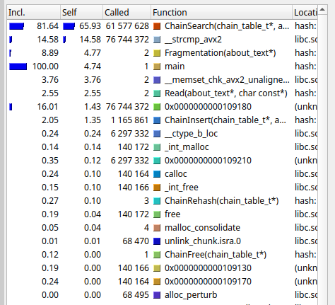

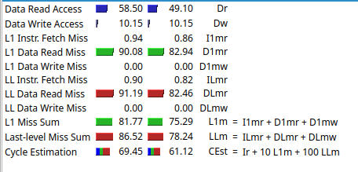

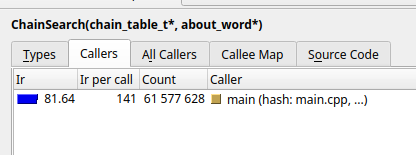

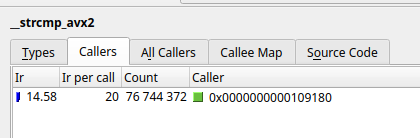


Func Name            | Self (%)     | Instructions per call |  
---------------------|--------------|-----------------------|
ChainSearch          | 65.93        | 141                   | 
HashCrc32            | -            | -                     | 
Strlen               | -            | -                     | 
Strcmp               | 14.58        | 20                    | 


# Таблица результатов


Test Name            | Average         | StdDev          | RelError  
---------------------|-----------------|-----------------|-----------
base_O0              | 2.17e+10        | 4.48e+07        | 0.21%
base_O3              | 1.57e+10        | 2.87e+06        | 0.02%
crc32                | 1.55e+10        | 5.35e+07        | 0.34%
strlen               | 1.54e+10        | 6.01e+07        | 0.39%
strcmp               | 1.57e+10        | 7.94e+06        | 0.05%

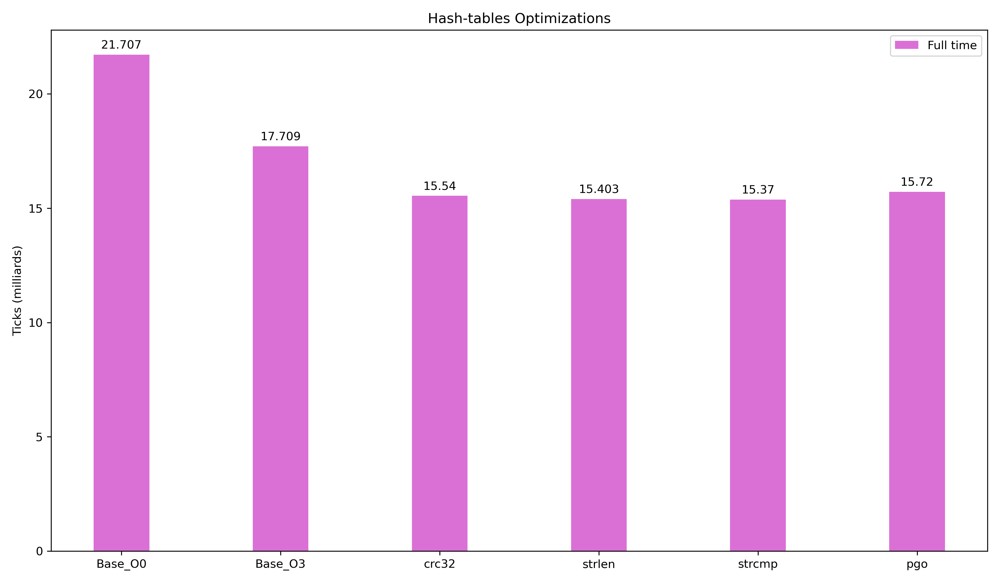